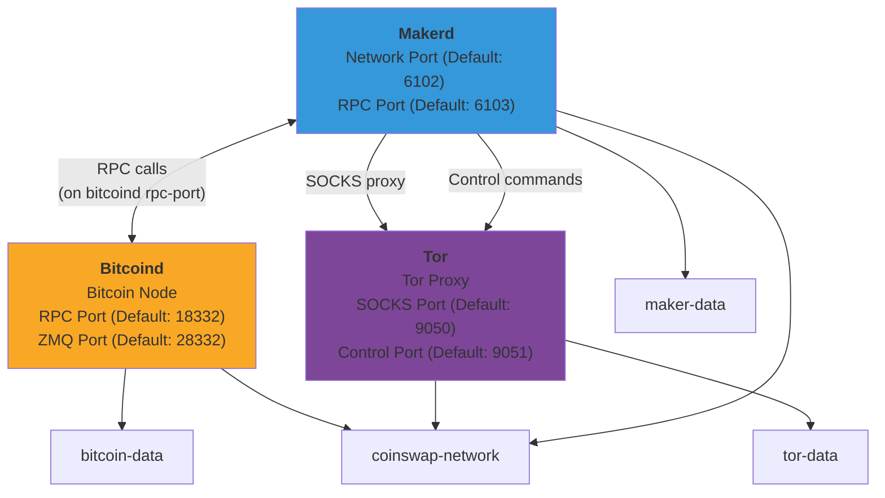

# Docker Setup & Usage Guide

This guide covers how to build and run Coinswap using Docker with a modern multi-service architecture.

## Overview

The Docker setup provides a complete environment for running Coinswap applications:

- **Single unified Dockerfile** containing all Coinswap components
- **Alpine Linux 3.20** base image for minimal size
- **Rust 1.90.0** for building the applications
- **Custom Bitcoin Mutinynet image** for Signet testing
- **External Tor image** (`leplusorg/tor`)
- **Interactive configuration** with automatic service detection
- Coinswap binaries: `makerd`, `maker-cli`, `taker`

## Architecture

This is an overview for the docker stack with default settings for all nodes:



The Docker setup uses:

- `docker/Dockerfile` - Unified image containing `makerd`, `maker-cli`, and `taker`
- `docker/Dockerfile.bitcoin-mutinynet` - Custom Bitcoin Core image for Mutinynet
- External images: `leplusorg/tor` for Tor

## Quick Start

### Using the Setup Script (Recommended)

The `docker-setup` script provides an interactive way to configure and run Coinswap:

```bash
git clone https://github.com/citadel-tech/coinswap.git
cd coinswap

# Interactive configuration
./docker-setup configure

# Build the Docker image
./docker-setup build

# (Optional) Build the Bitcoin Mutinynet image if needed
./docker-setup build-bitcoin

# Start the complete stack
./docker-setup start

# Check status
./docker-setup status

# View logs
./docker-setup logs makerd
```

### Configuration Options

The setup script will prompt for:

1. **Bitcoin Core Configuration**:
   - Data directory path
   - Network selection (regtest/signet/testnet/mainnet)
   - Use existing Bitcoin Core instance or spawn new one
   - Custom RPC and ZMQ ports

2. **Tor Configuration**:
   - Detect existing Tor instance
   - Use external Tor or spawn containerized version
   - Custom SOCKS and control ports

3. **Service Ports**:
   - Makerd network port (default: 6102)
   - Makerd RPC port (default: 6103)

Configuration is saved to `.docker-config` and reused on subsequent runs.

## Building Docker Images

The build process creates a single image containing all binaries:

```bash
git clone https://github.com/citadel-tech/coinswap.git
cd coinswap

# Build using the setup script
./docker-setup build

# Build Bitcoin Mutinynet image
./docker-setup build-bitcoin

# Or build manually
docker build -f docker/Dockerfile -t coinswap:latest .
```

### Available Images

- **coinswap**: Contains `makerd`, `maker-cli`, and `taker`
- **bitcoin-mutinynet**: Custom Bitcoin Core node for Mutinynet network

## Running Applications

### Makerd (Maker Daemon)

Run the maker daemon with persistent data storage:

```bash
# Using the setup script (recommended)
./docker-setup start

# Or manually with specific image
docker run -d \
  --name coinswap-makerd \
  -p 6102:6102 \
  -p 6103:6103 \
  -v coinswap-maker-data:/home/coinswap/.coinswap \
  --network coinswap-network \
  coinswap:latest makerd
```

**Port mappings:**
- `6102`: Maker network port for coinswap protocol
- `6103`: Maker RPC port for `maker-cli` commands

### Maker CLI

Control the maker daemon:

```bash
# Using the setup script
./docker-setup maker-cli ping
./docker-setup maker-cli wallet-balance
./docker-setup maker-cli stop

# Or manually
docker run --rm --network coinswap-network coinswap:latest maker-cli ping
docker run --rm --network coinswap-network coinswap:latest maker-cli wallet-balance
docker run --rm --network coinswap-network coinswap:latest maker-cli stop
```

### Taker

Run taker operations:

```bash
# Using the setup script
./docker-setup taker --help

# Or manually
docker run --rm -it \
  -v coinswap-taker-data:/home/coinswap/.coinswap \
  --network coinswap-network \
  coinswap:latest taker --help
```

## Docker Compose Setup

The setup script automatically generates `docker-compose.generated.yml` based on your configuration. For a complete setup with all services:

```bash
# Start all services (Bitcoin Core, Tor, Makerd)
./docker-setup start

# Or use docker-compose directly
docker compose -f docker-compose.generated.yml up -d

# Check status
./docker-setup status

# View logs
./docker-setup logs makerd
```

## Data Persistence

All application data is stored in Docker volumes:

- `bitcoin-data`: Bitcoin blockchain data
- `tor-data`: Tor configuration and data
- `maker-data`: Maker configuration and wallet data

## Troubleshooting

### Check logs

```bash
# using setup script
./docker-setup logs makerd

# or directly with docker-compose
docker compose -f docker-compose.generated.yml logs -f makerd
```

### Interactive debugging

```bash
# enter container for debugging
./docker-setup shell

# or manually
docker run --rm -it coinswap:latest sh
```
