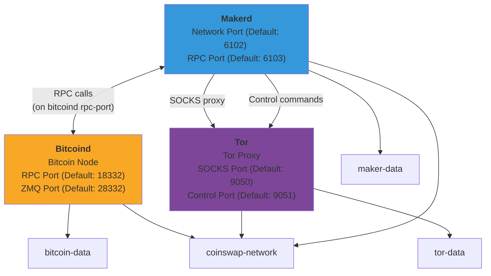

# Docker Setup & Usage Guide

This guide covers how to build and run Coinswap using Docker with a modern multi-service architecture.

## Overview

The Docker setup provides a complete environment for running Coinswap applications with service-specific containers:

- **Service-specific Dockerfiles** for optimal maintainability and efficiency
- **Alpine Linux 3.20** base images for minimal size
- **Rust 1.90.0** for building the applications
- **External images** for Bitcoin Core and Tor
- **Interactive configuration** with automatic service detection
- Coinswap binaries: `makerd`, `maker-cli`, `taker`

## Architecture

This is an overview fro the docker stack with default settings for all nodes:



The Docker setup uses multiple specialized containers:

- `docker/Dockerfile.builder` - Shared build stage for all Rust binaries
- `docker/Dockerfile.maker` - Maker daemon service
- `docker/Dockerfile.taker` - Taker client service  
- `docker/Dockerfile.tor` - Custom Tor service container
- `docker/Dockerfile.test` - Test environment with all binaries
- External images: `bitcoin/bitcoin` for Bitcoin Core

## Quick Start

### Using the Setup Script (Recommended)

The `docker-setup.sh` script provides an interactive way to configure and run Coinswap:

```bash
git clone https://github.com/citadel-tech/coinswap.git
cd coinswap

# Interactive configuration
./docker-setup.sh configure

# Build all Docker images
./docker-setup.sh build

# Start the complete stack
./docker-setup.sh start

# Check status
./docker-setup.sh status

# View logs
./docker-setup.sh logs makerd
```

### Configuration Options

The setup script will prompt for:

1. **Bitcoin Core Configuration**:
   - Data directory path
   - Network selection (regtest/signet/testnet/mainnet)
   - Use existing Bitcoin Core instance or spawn new one
   - Custom RPC and ZMQ ports

2. **Tor Configuration**:
   - Detect existing Tor instance
   - Use external Tor or spawn containerized version
   - Custom SOCKS and control ports

3. **Service Ports**:
   - Makerd network port (default: 6102)
   - Makerd RPC port (default: 6103)

Configuration is saved to `.docker-config` and reused on subsequent runs.

## Building Docker Images

The build process uses a shared builder stage and service-specific images:

```bash
git clone https://github.com/citadel-tech/coinswap.git
cd coinswap

# Build all images using the setup script
./docker-setup.sh build

# Or build manually
docker build -f docker/Dockerfile.builder --target builder -t coinswap-builder:latest .
docker build -f docker/Dockerfile.builder -t coinswap-base:latest .
docker build -f docker/Dockerfile.maker -t coinswap-maker .
docker build -f docker/Dockerfile.taker -t coinswap-taker .
docker build -f docker/Dockerfile.tor -t coinswap-tor .
```

The build process uses multi-stage builds and caching for optimal performance:
- Shared builder stage compiles all Rust binaries
- Common base stage provides runtime environment
- Dependencies are cached separately from source code
- Service-specific images only include necessary binaries
- Each service gets a minimal Alpine runtime image

### Available Images

- **coinswap-builder**: Shared builder with all compiled binaries
- **coinswap-base**: Common runtime base for all services
- **coinswap-maker**: Maker daemon service (`makerd`, `maker-cli`)
- **coinswap-taker**: Taker client service (`taker`)
- **coinswap-tor**: Tor proxy service
- **coinswap-test**: Test environment with all binaries

## Running Applications

### Makerd (Maker Daemon)

Run the maker daemon with persistent data storage:

```bash
# Using the setup script (recommended)
./docker-setup.sh start

# Or manually with specific image
docker run -d \
  --name coinswap-makerd \
  -p 6102:6102 \
  -p 6103:6103 \
  -v coinswap-maker-data:/home/coinswap/.coinswap \
  --network coinswap-network \
  coinswap-maker
```

**Port mappings:**
- `6102`: Maker network port for coinswap protocol
- `6103`: Maker RPC port for `maker-cli` commands

### Maker CLI

Control the maker daemon:

```bash
# Using the setup script
./docker-setup.sh maker-cli ping
./docker-setup.sh maker-cli wallet-balance
./docker-setup.sh maker-cli stop

# Or manually
docker run --rm --network coinswap-network coinswap-maker maker-cli ping
docker run --rm --network coinswap-network coinswap-maker maker-cli wallet-balance
docker run --rm --network coinswap-network coinswap-maker maker-cli stop
```

### Taker

Run taker operations:

```bash
# Using the setup script
./docker-setup.sh taker --help

# Or manually
docker run --rm -it \
  -v coinswap-taker-data:/home/coinswap/.coinswap \
  --network coinswap-network \
  coinswap-taker --help
```

## Running Tests

### Integration Tests

Run the complete test suite using Docker:

```bash
# Using the setup script (recommended)
./docker-setup.sh test

# Or manually
docker build -f docker/Dockerfile.builder --target builder -t coinswap-builder:latest .
docker build -f docker/Dockerfile.test -t coinswap-test .
docker run --rm -it coinswap-test
```

The test environment includes:
- All source code and test files
- Pre-built test dependencies
- Integration test features enabled

### Test Data Persistence

Test data can be persisted using volumes:

```bash
docker run --rm -it \
  -v coinswap-test-data:/home/coinswap/.coinswap \
  coinswap-test
```

## Docker Compose Setup

The setup script automatically generates `docker-compose.generated.yml` based on your configuration. For a complete setup with all services:

```bash
# Start all services (Bitcoin Core, Tor, Makerd)
./docker-setup.sh start

# Or use docker-compose directly
docker compose -f docker-compose.generated.yml up -d

# Check status
./docker-setup.sh status

# View logs
./docker-setup.sh logs makerd
```

### Example Generated Configuration

The setup script creates configuration like this:

```yaml
services:
  bitcoind:
    image: bitcoin/bitcoin:master-alpine
    container_name: coinswap-bitcoind
    command: |
      bitcoind
      -regtest=1
      -server=1
      -fallbackfee=0.0001
      -rpcuser=coinswap
      -rpcpassword=coinswappass
      -rpcallowip=0.0.0.0/0
      -rpcbind=0.0.0.0:18332
      -zmqpubrawblock=tcp://0.0.0.0:28332
      -zmqpubrawtx=tcp://0.0.0.0:28332
      -txindex=1
    ports:
      - "18332:18332"
      - "28332:28332"
    volumes:
      - bitcoin-data:/home/bitcoin/.bitcoin

  tor:
    build:
      context: .
      dockerfile: docker/Dockerfile.tor
    image: coinswap-tor
    container_name: coinswap-tor
    ports:
      - "9050:9050"
      - "9051:9051"
    volumes:
      - tor-data:/var/lib/tor

  makerd:
    build:
      context: .
      dockerfile: docker/Dockerfile.maker
    image: coinswap-maker
    container_name: coinswap-makerd
    command: makerd --rpc bitcoind:18332 --auth coinswap:coinswappass
    ports:
      - "6102:6102"
      - "6103:6103"
    volumes:
      - maker-data:/home/coinswap/.coinswap
    depends_on:
      - bitcoind
      - tor
    environment:
      - RUST_LOG=info

volumes:
  bitcoin-data:
  tor-data:
  maker-data:

networks:
  default:
    name: coinswap-network
```

## Data Persistence

All application data is stored in Docker volumes:

- `bitcoin-data`: Bitcoin blockchain data
- `tor-data`: Tor configuration and data
- `maker-data`: Maker configuration and wallet data
- `taker-data`: Taker wallet data (when using manual commands)

## Troubleshooting

### Check logs

```bash
# using setup script
./docker-setup.sh logs makerd

# or directly with docker-compose
docker compose -f docker-compose.generated.yml logs -f makerd
```

### Interactive debugging

```bash
# enter container for debugging
./docker-setup.sh shell

# or manually
docker run --rm -it coinswap-taker sh
```

### Network connectivity

```bash
# test maker connectivity
./docker-setup.sh maker-cli ping

# check Bitcoin connection
docker exec coinswap-makerd sh -c "makerd --rpc bitcoind:18332 --auth coinswap:coinswappass --help"
```
